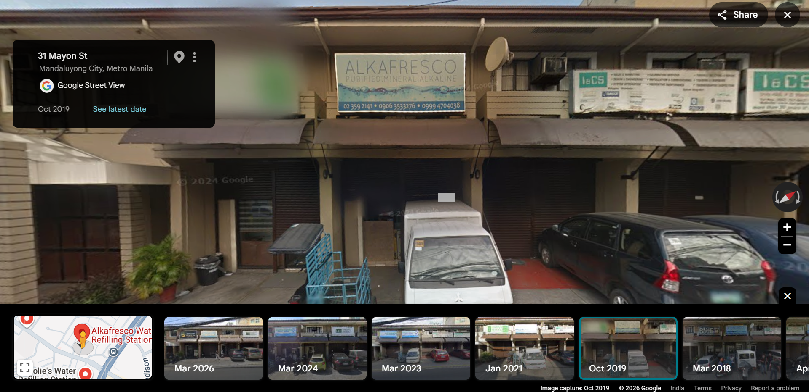
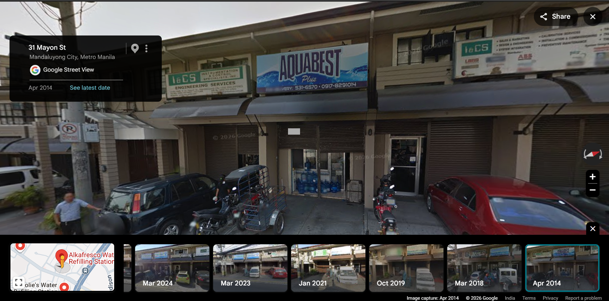

# Water Bottle - TryHackMe

## Overview

| Platform | TryHackMe |
|----------|-----------|
| Category | OSINT |
| Difficulty | Easy |

---

## Objective

Investigate a former water refilling station near Boni Avenue using Open Source Intelligence (OSINT) techniques to identify the original business.

---

## Skills Practiced

- OSINT
- Google Maps Investigation
- Historical Street View Analysis
- Business Enumeration
- Information Verification

---

## Tools Used

- Google Search
- Google Maps
- Google Street View

---

## Methodology

### Step 1 - Analyze the Challenge

The challenge provided two important clues:

- The location was near Boni Avenue.
- The contact number started with **63922**.

These clues helped narrow the investigation.

---

### Step 2 - Locate the Water Station

Using Google Maps, I searched for water refilling stations around Boni Avenue and identified the current establishment.

**Observation**

The location currently contains **Alkafresco Water Refilling Station**, suggesting that the original business had been replaced.

---

### Step 3 - Review Historical Street View

Google Street View's historical imagery was used to inspect older captures of the same location.

**Observation**

The April 2014 imagery revealed the previous business operating at the location, confirming the original water station.

---

### Step 4 - Verify the Findings

The business information was verified using publicly available search results and business listings.

---

## Key Learnings

- Historical Street View is an effective OSINT resource.
- Small clues such as location names and partial phone numbers can significantly narrow an investigation.
- Cross-verifying information using multiple public sources increases confidence in findings.

---

## References

- Google Maps
- Google Street View

---

## Disclaimer

This writeup is for educational purposes only and focuses on the investigative methodology. It does not include protected challenge answers or flags.
